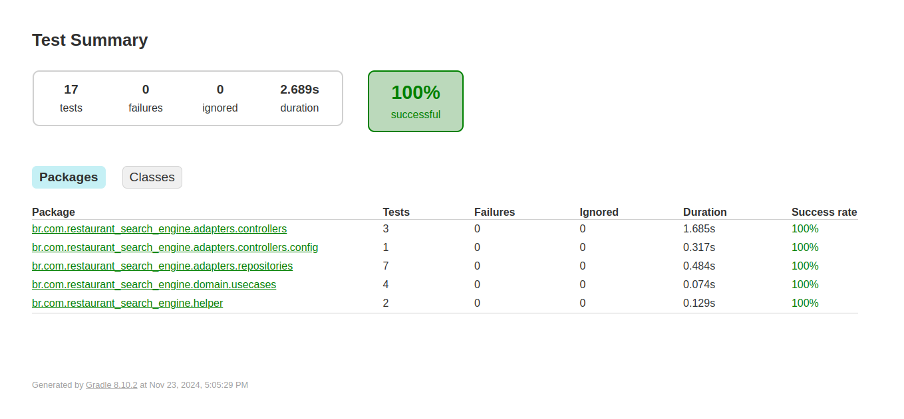
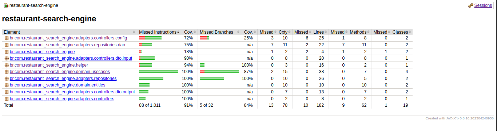

# Restaurant search engine
Restaurant search engine - Fullstack Technical Assessment
by Matheus de Andrade Lima

While developing this project I decided to demonstrate not only my coding skill but also my expertise with tests and observability.
I believe these skills are really important to developing robust, reliable and resilient applications.

## Assumptions

- Lowercase and uppercase don`t matter for string inputs.
  e.g. italian/Italian 

- Restaurants.csv and cuisine.csv files won`t be updated during program execution, then I can cache for better performance.

- Max length for string inputs is 100 characters then I can avoid some vulnerabilities.
  https://en.wikipedia.org/wiki/Improper_input_validation

- If the user does not specify a field, default value will be the less restrictive allowed value for that field.
  e.g. default value for price: 50

- Numeric inputs type is set as Double in case we need to change and adapt to this functionality in the future.

## Running application

- To run this project you must have the programs below installed on your local machine. I recommend using linux to run this application.
    - java17+
    - docker

Run the command bellow to install necessary dependencies and images to deploy on docker using docker-compose.

```
sudo bash docker-setup.sh
```

## Using application 

- http://localhost:8080/actuator/health to check out application health.

- Import collection available in 'docs' folder or use curl request below.
If you import the collection make sure you are using the 'docker' environment.
'local' environment is to test app running on IDE, the only difference is webserver port.
  - App runs in port 8080 for docker environment.
  - App runs in port 8081 for local environment.

```
curl --request POST \
  --url http://localhost:8080/search \
  --header 'Content-Type: application/json' \
  --header 'User-Agent: insomnia/10.1.1' \
  --data '{
	"name": "",
	"customer_rating": 1,
	"distance": 10,
	"price": 10,
	"cuisine": "italian"
}'
```

To stop you can run
```
sudo docker-compose -f docker-compose.yml down
```

## Tests

* This repository has 91% of total coverage
* Includes unit and integration tests



you can check this out by clicking: 

build-> reports-> tests-> test-> index.html (open with your browser)



you can check this out by:

first run

```
./gradlew jacocoTestReport
```

then click
build-> reports-> jacoco-> test-> html-> index.html (open with your browser)


## Observability

### Loki
- http://localhost:3000/dashboards to check out logs.


### Grafana
- http://localhost:3000/dashboards to check out grafana dashboards.
  - 

### Jaeger
- http://localhost:16686/search to check out tracing on Jaeger.
  - 


This project benefits from [OpenTelemetry](https://opentelemetry.io/) as a generic way to collect and send spans to tracers.
