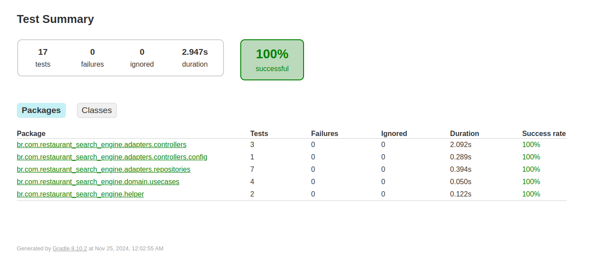

# Restaurant search engine
Restaurant search engine - Fullstack Technical Assessment
by Matheus de Andrade Lima

While working on this project, I aimed to showcase not only my coding skills but also my expertise in testing and observability. I believe these skills are essential for building robust, reliable, and resilient applications that can perform well in real-world scenarios.

## Assumptions

- Lowercase and uppercase don`t matter for string inputs.
  e.g. italian/Italian 

- Restaurants.csv and cuisine.csv files won`t be updated during program execution, then I can cache for better performance.

- Max length for string inputs is 100 characters then I can avoid some vulnerabilities.
  https://en.wikipedia.org/wiki/Improper_input_validation

- Null values won't be accepted, user might not send a field, then it will be defined a default value.

- If the user does not specify a field, default value will be the less restrictive allowed value for that field.
  e.g. default value for price: 50 / default value for customer rating: 1

- Numeric inputs type is set as Double in case we need to change and adapt to this functionality in the future.

## Running application

- To run this project you must have the programs below installed on your local machine. I recommend using linux to run this application.
    - java17+
    - docker

Run the command bellow to install necessary dependencies and images to deploy on docker using docker-compose.

```
sudo bash docker-setup.sh
```

## Using application 

- http://localhost:8080/actuator/health to check out application health.

- Import collection available in 'docs' folder or use curl request below.
If you import the collection make sure you are using the 'prod' environment.


'local' environment is to test app running on IDE, the only difference is webserver port.
  - App runs in port 8080 for prod environment.
  - App runs in port 8081 for local environment.

```
curl --request POST \
  --url http://localhost:8080/search \
  --header 'Content-Type: application/json' \
  --header 'User-Agent: insomnia/10.1.1' \
  --data '{
	"name": "",
	"customer_rating": 1,
	"distance": 10,
	"price": 10,
	"cuisine": "italian"
}'
```

## Tests

* This repository has 89% of line coverage
* Includes unit and integration tests



you can check this out by clicking: 

build-> reports-> tests-> test-> index.html (open with your browser)


### Jacoco view


you can check this out:

first run

```
sudo ./gradlew jacocoTestReport
```

then click
build-> reports-> jacoco-> test-> html-> index.html (open with your browser)


## Observability

### Loki (logs)
- http://localhost:3000/explore to check out logs.
  - select 'Loki' datasource
  - In label filters select 'app' and then 'restaurant-search-engine'
  - click blue button to run


### Grafana dashboards (metrics)
- http://localhost:3000/dashboards to check out grafana dashboards.
  - Click 'JVM (Micrometer)'
  - Select 'Last five minutes'


or you can take a look at individual metrics

- http://localhost:3000/explore 
  - select 'Prometheus' datasource
  - Choose a metric and select application 'restaurant-search-engine'
  - click blue button to run


### Jaeger (tracing)
- http://localhost:16686/search to check out tracing on Jaeger.
  - Click 'find traces'


To stop you can run
```
sudo docker-compose -f docker-compose.yml down
```

This project benefits from [OpenTelemetry](https://opentelemetry.io/) as a generic way to collect and send spans to tracers.
